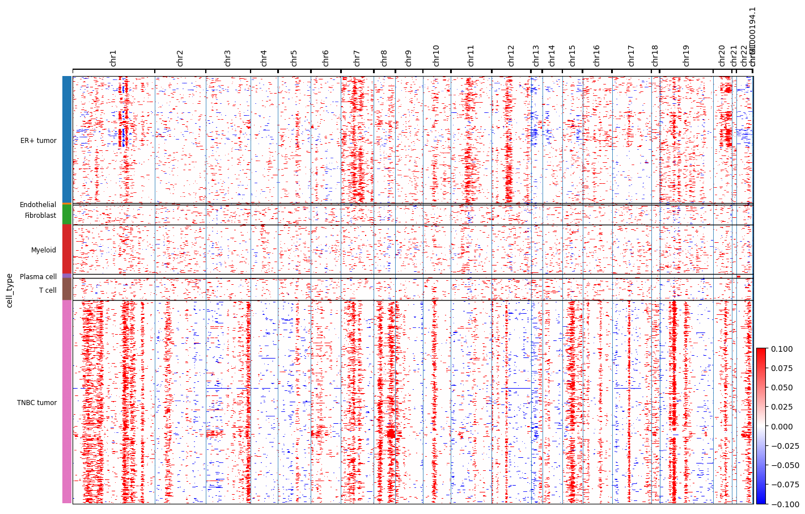

# Single-Cell RNA-seq Analysis of the Breast Cancer Tumor Microenvironment

Single-cell dissection of the tumor microenvironment in ER+ and triple-negative
breast cancer (TNBC) — resolving cell types and proving malignant-cell genomic
instability at single-cell resolution.

**Stack:** Python · Scanpy · Harmony · inferCNVpy
**Data:** GSE161529 (Pal et al., *EMBO J* 2021)

---

## Motivation

This project extends prior **bulk RNA-seq** work comparing TNBC and ER+ breast
tumors. Bulk analysis found subtype-specific marker differences (GATA3/ESR1 in ER+;
KRT14/FOXC1 in TNBC) — but bulk RNA-seq averages all cells in a sample together.
It cannot say *which cells* express a signal, nor separate malignant cells from the
normal immune and stromal cells packed into the same tumor. Single-cell resolution
answers what bulk cannot:

- What cell types make up the breast tumor microenvironment (TME)?
- Do the bulk ER+/TNBC marker differences actually localize to the tumor cells?
- Which epithelial cells are *genuinely malignant* (chromosomally abnormal)?

## Dataset selection

Choosing the dataset was a deliberate step, not a given:

- **Requirement:** publicly downloadable count matrices (no controlled access),
  a published cell-type annotation for validation, and both ER+ and TNBC tumors
  to mirror the bulk comparison.
- **Rejected:** the widely-used Wu et al. 2021 breast atlas — its data sits behind
  EGA controlled access (application required), a dead end for a reproducible project.
- **Chosen:** GSE161529 (Pal et al.) — 69 open-access 10x profiles, ~340k cells,
  spanning normal, ER+, HER2+, and TNBC tissue, with deposited cell annotations.

**Sample shortlisting (4 of 69):** Rather than process all 69 samples (unnecessary
compute, out of scope), I selected **2 ER+ and 2 TNBC primary tumors**:
- whole-tumor captures (not epithelial-sorted) — to retain the full microenvironment
  (immune + stromal + malignant), which is the point of a TME analysis;
- primary tumors only — lymph-node and metastatic samples excluded for a clean
  primary-tumor comparison;
- 4 different patients — providing a genuine batch effect to correct, and mirroring
  the TNBC-vs-ER+ axis of the bulk project.

Final samples: `ER-MH0001`, `ER-MH0042` (ER+); `TN-MH0126`, `TN-MH0135` (TNBC).
After QC: **31,265 cells**.

## Why count matrices, not FASTQs

The analysis starts from 10x count matrices, not raw reads. Upstream
demultiplexing and alignment (Cell Ranger) is standard, compute-heavy plumbing
that demonstrates nothing a count matrix doesn't — the analytical skill being
shown here is everything downstream of the matrix. This is stated explicitly as a
scope decision, not an omission.

## Key findings

1. **Seven cell types resolved** — malignant epithelium (ER+ and TNBC), T cells,
   myeloid, fibroblasts, endothelial, and plasma cells — concordant with independent
   published annotation of the same data (pericytes not separately resolved at the
   chosen clustering resolution; an expected granularity difference, not a misannotation).

2. **Subtype markers localize to the tumor compartment.** ER+ markers
   (ESR1, GATA3, FOXA1) and the TNBC marker KRT14 are expressed specifically in the
   malignant epithelial clusters — not in immune or stromal cells — confirming the
   bulk RNA-seq subtype signal reflects genuine tumor-cell biology.

3. **CNV inference confirms malignancy cell-by-cell.** Tumor cells carry genome-wide
   copy-number abnormalities absent from immune/stromal reference cells, and
   **TNBC shows greater genomic instability than ER+** (mean CNV score 0.013 vs 0.009)
   — independently recovering a documented clinical feature of TNBC.



*Genome-wide copy-number landscape. Columns = genome position (chr1→chr22),
rows = cells grouped by type. Tumor cells (ER+, TNBC) show extensive chromosomal
gains (red) and losses (blue); immune and stromal cells remain flat. TNBC is
visibly more disrupted than ER+.*

## Approach

| Stage | What | Key decisions |
|-------|------|---------------|
| 1. QC | Remove empty droplets, doublets, dying cells | Thresholds set from observed distributions, not tutorial defaults; scrublet for residual doublets; mito-prefix verified |
| 2. Integration | Normalize, HVG, PCA, batch-correct, cluster | Harmony applied *only after* confirming a visible patient batch effect; resolution 0.5 chosen by biological coherence across 3 tested values |
| 3. Annotation | Marker-based cell typing | Curated known markers confirmed (and corrected) identities; validated against published annotation |
| 4. CNV | Per-cell copy-number inference | Immune/stromal cells as normal reference; tumor-vs-normal genomic instability quantified per cell |

## Why single-cell over bulk

Bulk found the subtype *signature*. Single-cell **localizes that signature to the
malignant epithelial compartment** and **proves malignancy cell-by-cell** via
copy-number inference. Bulk can detect sample-level CNV but can never separate a
malignant epithelial cell from a normal one sitting beside it — the core advantage
demonstrated here.

## Repository

- `01_qc.ipynb` — quality control
- `02_normalize_cluster.ipynb` — normalization, Harmony integration, clustering
- `03_annotation.ipynb` — cell-type annotation and validation
- `04_cnv.ipynb` — copy-number inference
- `environment.yml` — reproducible conda environment

## Reproducibility note

## Reproducing

```bash
conda env create -f environment.yml && conda activate scrna
bash download.sh        # fetches GSE161529, extracts the 4 samples
# then run notebooks 01 → 04 in order
```

Gene genomic positions for CNV were fetched live from Ensembl BioMart. For a
production pipeline requiring exact reproducibility, a pinned GENCODE GTF would be
preferred; BioMart was chosen here for convenience with the tradeoff documented.
